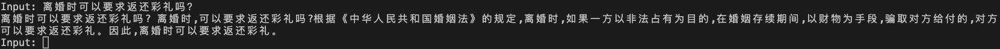
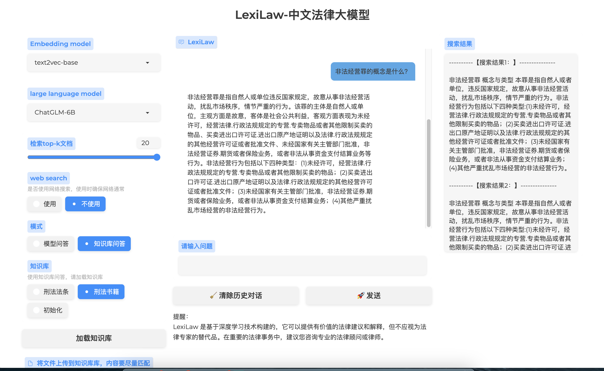

<!--
 * @Author: lihaitao
 * @Date: 2023-05-16 19:48:12
 * @LastEditors: Do not edit
 * @LastEditTime: 2023-05-24 19:34:27
 * @FilePath: /lht/GitHub_code/LexiLaw/README.md
-->
# LexiLaw - 中文法律大模型

欢迎来到 LexiLaw 项目！这个项目旨在提供专业的中文法律咨询服务，并分享在大模型在垂直领域微调的经验，以帮助社区开发更多优质的专用领域的大模型。

我会继续研究成文法和判例法体系的智慧司法研究，欢迎大家follow我关注最新动态，欢迎大家有新的想法与我交流！

🔥为类案检索设计的结构感知预训练语言模型[SAILER](https://github.com/CSHaitao/SAILER)已被SIGIR2023录用并开源！

## 免责声明

请各位严格遵守如下约定：

1. 本项目任何资源**仅供学术研究使用，严禁任何商业用途**。
2. 模型输出受多种不确定性因素影响，本项目当前无法保证其准确性，**严禁用于真实法律场景**。
3. 本项目不承担任何法律责任，亦不对因使用相关资源和输出结果而可能产生的任何损失承担责任。

## 项目简介

LexiLaw 是一个经过微调的中文法律大模型，它基于 ChatGLM-6B 架构，通过在法律领域的数据集上进行微调，使其在提供法律咨询和支持方面具备更高的性能和专业性。

该模型旨在为法律从业者、学生和普通用户提供准确、可靠的法律咨询服务。无论您是需要针对具体法律问题的咨询，还是对法律条款、案例解析、法规解读等方面的查询，LexiLaw 都能够为您提供有益的建议和指导。

同时，我们将分享在大模型基础上微调的经验和最佳实践，以帮助社区开发更多优秀的中文法律大模型，推动中文法律智能化的发展。

## 功能和特点

- **专业法律知识**：LexiLaw 经过在大规模法律数据集上的微调，拥有丰富的中文法律知识和理解能力，能够回答各类法律问题。

- **法律咨询服务**：通过与 LexiLaw 进行交互，您可以提出具体的法律问题，模型将根据您的输入提供详细和准确的回答，为您提供法律咨询和支持。

- **广泛应用场景**：LexiLaw 适用于各种法律领域，包括但不限于合同法、劳动法、知识产权、民事诉讼、刑事法等。无论您是法律从业者、学生还是需要法律帮助的个人，我们都希望通过这个模型为您提供有价值的支持。

- **经验分享**：我们将分享在大模型微调方面的经验和最佳实践，帮助社区的开发者们更好地构建和微调中文法律大模型，推动法律智能化的进步。

- **持续更新**：我们会不断更新和改进模型，以确保它与最新的法律发展和变化保持同步。您可以定期获取最新的模型版本和更新内容。

## 如何使用

- ***命令行交互***

    1. 克隆或下载本项目到您的本地环境。
        ```
        git clone https://github.com/CSHaitao/LexiLaw.git
        cd LexiLaw
        ```

    2. 安装所需的依赖项和配置环境。

        ```
        pip install -r requirements.txt
        ```

    3. 下载训练好的参数放在`/model`目录下。每种方法只开源了一个checkpoint。后续会陆续开源其他checkpoint供大家研究。
        - [LexiLaw_finetune](https://drive.google.com/file/d/1buUUNjEVhx8PU1eBus3KitJzI5pdWbW_/view?usp=sharing):包含pytorch_model-00001-of-00002.bin和pytorch_model-00002-of-00002.bin两个文件，其他配置文件与ChatGLM一致。[百度网盘链接](https://pan.baidu.com/s/12akBgZMlFUJ9NK-HIZh5uA?pwd=nmjp)（提取码: nmjp）
        - [LexiLaw_Ptuningv2](https://drive.google.com/file/d/1sTh_7DMsX9Cj95O7k1gfsYxB7d1d8soQ/view?usp=sharing):包含pytorch_model.bin。
        - [LexiLaw_LoRA](https://drive.google.com/file/d/1p9kf1GCeaf1AzSv6ZyzEBO3DTgKDetHI/view?usp=sharing):包含adapter_model.bin和adapter_config.json两个文件。

    4. 运行`python inference_method.py`，通过与模型进行交互，提供具体的法律问题或相关法律文本，LexiLaw 将根据您的输入提供相应的回答和解释。

    

- ***Demo交互***

    除了简单的命令行交互，我们参考[Chinese-LangChain](https://github.com/yanqiangmiffy/Chinese-LangChain)实现了知识库增强的LexiLaw。
    
    1. 克隆或下载本项目到您的本地环境。
        ```
        git clone https://github.com/CSHaitao/LexiLaw.git
        cd LexiLaw/demo
        ```

    2. 安装所需的依赖项和配置环境。

        ```
        pip install -r requirements.txt
        ```
    3. 下载训练好的参数放在`/model`目录下。

    4. 下载[text2vec模型](https://huggingface.co/GanymedeNil/text2vec-large-chinese)放在`LexiLaw/demo/text2vec`目录下。

    5. 下载编码好的知识库向量放在`LexiLaw/demo/cache`目录下。LexiLaw开源了Legal_book与Legal_article的向量。
    
    | 知识库              | 描述                                               | 下载链接                                                         |
    | ------------------ | --------------------------------------------------------- | ------------------------------------------------------------ |
    | Legal_book          | 包含法理学、国际法、国际经济法、国际私法、环境资源法、经济法、劳动与社会保障法、民法、民事诉讼法、商法、司法制度与法律职业道德、宪法、刑法、刑事诉讼法、知识产权法、中国特色社会主义法治理论的基本理论知识               | [Legal_book](https://drive.google.com/file/d/1h_Ce8S7bqr5D0ozmYSAAK8G2ivun9cvn/view?usp=sharing)    |
    | Legal_article         | 包含地方性法规、经济法、民法典、民法商法、社会法、司法解释、诉讼与非诉讼程序法、宪法、宪法相关法、刑法、行政法、行政法规等基本法条               | [Legal_article](https://drive.google.com/file/d/1_3Yw3Pt5vhtMMj6UOVHiCXFlNEe5LQPT/view?usp=sharing) |

    6. 运行`python main.py`进入以下界面:

    


    7. 选择知识库问答并加载相应的知识库，开始提问！如果想制作自己的知识库，可以通过`python create_knowledge.py`实现。


    

    

## 训练数据


LexiLaw 的训练数据是通过综合使用通用领域数据、专业法律数据和法律文书进行微调而得到的。我们发现仅使用法律领域数据进行微调容易导致严重的过拟合现象，会导致模型忘掉原有的能力。

因此, 我们采用了以下数据组合来丰富模型的知识和能力：

- **通用领域数据**：我们使用了大规模的通用领域文本数据集 **[BELLE](https://github.com/LianjiaTech/BELLE)** 1.5M，其中包括不同指令类型、不同领域的文本。通过引入通用领域数据，模型可以更好地理解自然语言和上下文信息，提高对各种问题的处理能力。

- **法律问答数据**：我们收集了丰富的法律问答数据，包括常见法律问题和相应的答案。这些问答数据涵盖了多个法律领域，如合同法、劳动法、知识产权等。通过使用这些数据，模型可以学习到常见法律问题的回答模式和解释能力。

    - **[LawGPT_zh](https://github.com/LiuHC0428/LAW-GPT)** :52k单轮问答数据和92k带有法律依据的情景问答
    - **[Lawyer LLaMA](https://github.com/AndrewZhe/lawyer-llama)** :法考数据和法律指令微调数据
    - **[华律网问答数据](https://www.66law.cn/)** :20k高质量华律网问答数据
    - **[法律知道](https://github.com/murufeng/ChineseNlpCorpus/blob/master/datasets/lawzhidao/intro.ipynb)** :百度知道收集的36k条法律问答数据

- **法律法规和法律参考书籍**：为了增强模型对法律条款和法规的理解，我们引入了包括法条和法律参考书籍在内的专业法律文本。这些文本提供了具体的法律规定和解释，帮助模型学习并提供更准确的法律解释和建议。

    - **[法律法规](https://github.com/LawRefBook/Laws)** 包含刑法、民法、宪法、司法解释等法律法规。构建以下格式的训练数据:

        > {"instruction": "给出以下法条的具体内容:", "input": " 畜禽规模养殖污染防治条例第二条", "answer": " 畜禽规模养殖污染防治条例第二条 本条例适用于畜禽养殖场、养殖小区的养殖污染防治。畜禽养殖场、养殖小区的规模标准根据畜牧业发展状况和畜禽养殖污染防治要求确定。牧区放牧养殖污染防治，不适用本条例。"}

    - **[法律参考书籍](https://jecqa.thunlp.org/)** JEC-QA数据集提供的法律参考书籍，可以通过 [JEC-QA](https://jecqa.thunlp.org/) 官网申请获得参考数据。构建以下格式的训练数据:

        > {"instruction": "请解释以下概念的具体含义:", "input": "管辖恒定", "answer": "管辖恒定，是指确定案件的管辖权，以起诉时为标准:起诉时对案件享有管辖权的法院，不因确定管辖的相关因素在诉讼过程中发生变化而影响其管辖权。\",管辖恒定包括级别管辖恒定和地域管辖恒定。《民诉解释》第37条规定:“案件受理后，受诉人民法院的管辖权不受当事人住所地.经常居住地变更的影响。”第38条规定:“有管辖权的人民法院受理案件后，不得以行政区域变更为由，将案件移送给变更后有管辖权的人民法院。判决后的上诉案件和依审判监督程序提审的案件，由原审人民法院的上级人民法院进行审判；上级人民法院指令再审.发回重审的案件，由原审人民法院再审或者重审。”第39条规定:“人民法院对管辖异议审查后确定有管辖权的，不因当事人提起反诉.增加或者变更诉讼请求等改变管辖，但违反级别管辖.专属管辖规定的除外。人民法院发回重审或者按第一审程序再审的案件，当事人提出管辖异议的，人民法院不予审查。”\","}


- **法律文书**：为了让模型熟悉实际的法律案例和文书，我们还使用了包括判决书、法院裁定书和法律文件等在内的法律文书。这些文书涵盖了各种法律领域和案件类型，使模型能够学习到真实案例的背景、判断和解决方法。

    - **[法律文书](https://wenshu.court.gov.cn/)** 从法律裁判文书网收集50k法律文书，使用正则匹配提取文书的事实部分和裁判分析过程部分，构建以下格式的训练数据:

        > {"instruction": "你现在是一个精通中国法律的法官，请对以下案件做出分析:", "input": "经审理查明：2015年5月，被告人xxx通过王某2以帮助被害人王某1“捞人”为由，在xxx前等地，诈骗被害人王某1人民币30余万元。被告人xxx于2016年9月20日被xxx抓获。案发前xxx向王某2归还人民币12.8万元，案发后向王某2归还800元；案发后向被害人王某1归还人民币28万余元。", "answer": "本院认为，被告人xxx以非法占有为目的，虚构事实，骗取他人财物，数额巨大，其行为已构成诈骗罪，应予处罚。xxx人民检察院指控被告人xxx犯诈骗罪的主要事实清楚、证据确实充分，罪名成立，唯被告人在案发前归还的部分钱款应从犯罪金额中扣除。鉴于被告人xxx到案后能够如实供述犯罪事实，认罪态度较好，且已退还被害人经济损失，故本院依法对其予以从轻处罚并宣告缓刑。被告人xxx的辩解及辩护人的辩护意见本院酌予采纳。"}

通过综合利用通用领域数据、专业法律数据、法律问答数据和法律文书，LexiLaw 在处理法律问题时能够提供准确、全面的法律咨询和支持。

请注意，LexiLaw 的训练数据仅用于模型微调和改进，不包含个人敏感信息或侵犯隐私的内容。


## 模型训练

我们采用以下三种方式对 ChatGLM-6B 进行了深度微调,所有的模型都是在 7 张40G A100上训练模型，训练代码使用DeepSpeed和Trainer，具体说明可见[ChatGLM_mutli_gpu_tuning](https://github.com/CSHaitao/ChatGLM_mutli_gpu_tuning). 相关训练代码在`'/src`目录下。

1. **LoRA**
    运行`sh lora.sh`  
    具体参数如下：
    ```bash
    CUDA_VISIBLE_DEVICES=${TOT_CUDA} deepspeed --master_port=$PORT --num_gpus=7 lora.py \
        --train_path ./instrution_data.json \
        --max_len 768 \
        --max_input_len 512 \
        --model_name_or_path ./chatGLM-6B \
        --tokenizer_name ./chatGLM-6B \
        --lora_rank 16 \
        --per_device_train_batch_size 12 \
        --gradient_accumulation_steps 2 \
        --num_train_epochs 6 \
        --save_strategy epoch \
        --learning_rate 5e-4 \
        --fp16 \
        --remove_unused_columns false \
        --logging_steps 50 \
        --output_dir /output \
        --deepspeed /ds_config.json \
    ```
    lora_rank = 16，训练参数量情况：
    ```
    trainable params: 7340032 || all params: 6180626432 || trainable%: 0.11875870643139365  
    ```

2. **P-tuning-v2**
    运行 `sh ptuning.sh`
    具体参数如下：
    ```bash
        CUDA_VISIBLE_DEVICES=${TOT_CUDA} deepspeed --master_port=$PORT --num_gpus=2 finetune_ptuning.py \
            --train_path ./instrution_data.json \
            --max_len 768 \
            --max_input_len 512 \
            --model_name_or_path /chatGLM-6B \
            --tokenizer_name/chatGLM-6B \
            --per_device_train_batch_size 8 \
            --gradient_accumulation_steps 4 \
            --num_train_epochs 6 \
            --save_strategy epoch \
            --learning_rate 5e-4 \
            --fp16 \
            --logging_steps 50 \
            --pre_seq_len 128 \
            --output_dir /output \
            --deepspeed ds_config.json \
    ```
    pre_seq_len = 128，prefix_projection = True，训练参数量情况：
    ```
    trainable params: 957059072 || all params: 7130345472 || trainable%: 13.42233803058007
    ```
    
3. **Finetune**
    运行`sh freeze.sh`
    具体参数如下：
    ```bash
    CUDA_VISIBLE_DEVICES=${TOT_CUDA} deepspeed --master_port=$PORT --num_gpus=3 finetune_freeze.py \
        --train_path  \
        --max_len 768 \
        --max_input_len 512 \
        --model_name_or_path /chatGLM-6B \
        --tokenizer_name /chatGLM-6B \
        --per_device_train_batch_size 16 \
        --gradient_accumulation_steps 4 \
        --num_train_epochs 4 \
        --save_strategy epoch \
        --learning_rate 1e-5 \
        --fp16 \
        --remove_unused_columns false \
        --logging_steps 50 \
        --output_dir output_freeze \
        --deepspeed ds_config.json \
    ```

    `finetune_freeze.py` 中设置只训练 `layers.27,layers.26,layers.25,layers.24,layers.23`。训练参数量情况：
    
    ```
    trainable params: 1006899200 || all params: 6173286400 || trainable%: 16.31058620575258
    ```


## 模型效果对比

**Input:** 施工方超过国家规定标准排放噪声，是否应当承担责任?

| 模型     | 结果                                                                                                                   |
|----------|------------------------------------------------------------------------------------------------------------------------|
| ChatGLM  | 如果施工方超过国家规定标准排放噪声,业主方(通常是开发商)可能承担责任。这是因为业主方与施工方之间存在合同关系,业主方应该确保施工方按照约定履行其职责,包括噪声排放方面的监管。如果施工方在噪声排放方面违反了规定,业主方可以要求施工方承担违约责任,并赔偿因此造成的损失。 当然,具体的责任分配和赔偿金额需要根据具体情况来确定。如果业主方能够提供证据证明施工方违反了规定,并且造成了损失,那么业主方有权要求施工方承担责任。如果无法提供证据,或者损失较小,那么可能需要与施工方协商解决。                                   |
| LexiLaw_Ptuningv2  | 根据《中华人民共和国环境噪声污染防治法》的规定,施工方应当采取有效措施,控制施工作业产生的噪声,并保证施工作业对周围居民和环境的影响。如果施工方超过国家规定标准排放噪声,导致周围居民和环境的影响,施工方应当承担相应的法律责任。因此,施工方超过国家规定标准排放噪声,应当承担相应的法律责任。                                                          |
| LexiLaw_Finetune | 根据《中华人民共和国环境保护法》的规定,施工方在建设、改建、扩建工程时,应当遵守环境保护法律、法规的规定,防止对环境造成污染。如果施工方超过国家规定标准排放噪声,就应当承担相应的法律责任。 因此,施工方应当遵守法律规定,确保工程的环境影响最小化,防止噪声污染。如果施工方违反法律规定,超过国家规定标准排放噪声,就应当承担相应的法律责任。|
| LexiLaw_LoRA | 根据《中华人民共和国环境噪声污染防治法》的规定,任何单位和个人不得超过国家规定的噪声排放标准排放噪声。如果施工方超过国家规定标准排放噪声,则应当承担相应的法律责任。具体责任大小取决于施工方的行为是否违反了法律规定,是否造成了环境污染和损害。如果施工方的行为违反了法律规定,则应当承担相应的民事责任和行政责任。如果施工方的行为没有违反法律规定,则不需要承担责任。


**Input:** 谁可以申请撤销监护人的监护资格?

| 模型     | 结果                                                                                                                   |
|----------|------------------------------------------------------------------------------------------------------------------------|
| ChatGLM  | 根根据中国法律,监护人可以依法申请撤销监护人资格的监护资格。监护人资格的撤销需要经过一定的程序,一般需要经过人民法院的判决。具体的申请程序和条件,需要根据具体情况来确定。如果监护人存在严重的行为或者犯罪行为,导致被监护人受到伤害或者损害,那么被监护人的亲属或者利害关系人可以向当地的人民法院申请撤销监护人的资格。                                |
| LexiLaw_Ptuningv2  | 根据《民法典-总则》的规定,未成年人的父母、配偶、成年子女、其他近亲属、监护人可以向人民法院申请撤销监护人资格的监护资格。被撤销监护人资格的监护人,应当另行指定监护人。                                                          |
| LexiLaw_Finetune | 据《民法典-总则》的规定,未成年人的父母是未成年人的监护人。未成年人的父母已经死亡或者没有监护能力的,由下列有监护能力的人按顺序担任监护人:(一)祖父母、外祖父母;(二)兄、姐;(三)其他愿意担任监护人的个人或者组织,但是须经未成年人住所地的居民委员会、村民委员会或者民政部门同意。对监护人的确定有争议的,由被监护人住所地的居民委员会、村民委员会或者民政部门指定监护人,有关当事人对指定不服的,可以向人民法院申请指定监护人;有关当事人也可以直接向人民法院申请指定监护人。居民委员会、村民委员会、民政部门或者人民法院应当尊重被监护人的真实意愿,按照最有利于被监护人的原则在依法具有监护资格的人中指定监护人。|
| LexiLaw_LoRA | 监护人是指依照法律规定,对未成年人、老年人、患病的人、残疾人等负有监护职责的人。根据《民法通则》的规定,监护人包括父母、祖父母、外祖父母、兄姐、配偶、子女、孙子女、外孙子女、朋友等。如果监护人的行为违反了法律规定,导致未成年人、老年人、患病的人、残疾人等遭受损害,那么受害人可以向法院申请撤销监护人的监护资格。


**Input:** 你现在是一个精通中国法律的法官，请对以下案件做出分析:经审理查明：被告人xxx于2017年12月，多次在本市xxx盗窃财物。具体事实如下：（一）2017年12月9日15时许，被告人xxx在xxx店内，盗窃白色毛衣一件（价值人民币259元）。现赃物已起获并发还。（二）2017年12月9日16时许，被告人xx在本市xxx店内，盗窃米白色大衣一件（价值人民币1199元）。现赃物已起获并发还。（三）2017年12月11日19时许，被告人xxx在本市xxx内，盗窃耳机、手套、化妆镜等商品共八件（共计价值人民币357.3元）。现赃物已起获并发还。（四）2017年12月11日20时许，被告人xx在本市xxxx内，盗窃橙汁、牛肉干等商品共四件（共计价值人民币58.39元）。现赃物已起获并发还。2017年12月11日，被告人xx被公安机关抓获，其到案后如实供述了上述犯罪事实。经鉴定，被告人xxx被诊断为精神分裂症，限制刑事责任能力，有受审能力。

| 模型     | 结果                                                                                                                   |
|----------|------------------------------------------------------------------------------------------------------------------------|
| ChatGLM  |根据《中华人民共和国刑法》的规定,对于患有精神疾病的犯罪分子,应当减轻或者免除处罚。因此,对于被告人尹巍的盗窃行为,可以减轻处罚,判处有期徒刑三年以下,并赔偿受害人的损失。                                   |
| LexiLaw_Ptuningv2  | 本院认为,被告人xx以非法占有为目的,多次秘密窃取他人财物,数额较大,其行为已构成盗窃罪,应予惩处。xx人民检察院指控被告人xx犯盗窃罪的事实清楚,证据确实、充分,指控罪名成立。被告人xx被诊断为精神分裂症,限制刑事责任能力,依法可以从轻处罚。被告人xx到案后如实供述自己的罪行,依法可以从轻处罚。                                                          |
| LexiLaw_Finetune | 本院认为,被告人xx以非法占有为目的,多次盗窃他人财物,其行为已构成盗窃罪,应予惩处。xxx人民检察院指控被告人xx犯盗窃罪的事实清楚,证据确实充分,指控罪名成立。鉴于被告人xx到案后如实供述犯罪事实,认罪态度较好,且其患有精神分裂症,本院依法对其从轻处罚。|
| LexiLaw_LoRA | 本院认为,被告人xx以非法占有为目的,多次盗窃他人财物,数额较大,其行为已构成盗窃罪,应予惩处。xxx人民检察院指控被告人尹巍犯有盗窃罪的事实清楚,证据确实、充分,指控罪名成立。鉴于被告人xx被诊断为限制刑事责任能力,有受审能力,本院在量刑时酌情予以考虑。

**Input:** 你现在是一个精通中国法律的法官,请对以下案件做出分析:2012年5月1日,原告xxx在被告xxxx购买“玉兔牌”香肠15包,其中价值558.6元的14包香肠已过保质期。xxx到收银台结账后,即径直到服务台索赔,后因协商未果诉至法院,要求xxxx店支付14包香肠售价十倍的赔偿金5586元。

| 模型     | 结果                                                                                                                   |
|----------|------------------------------------------------------------------------------------------------------------------------|
| ChatGLM  |根据《中华人民共和国食品安全法》第14条第3款的规定,禁止生产经营过期食品。根据《消费者权益保护法》第53条第1款的规定,消费者在购买、使用商品时,享有人身、财产安全不受损害的权利。根据上述法律规定,xxx有权要求xxxx店赔偿其因过期食品造成的身体和财产损害。 在本案中,xxx在被告xxxx店购买“玉兔牌”香肠15包,其中价值558.6元的14包香肠已过保质期。xxx到收银台结账后,即径直到服务台索赔,后因协商未果诉至法院,要求xxxx店支付14包香肠售价十倍的赔偿金5586元。 根据《中华人民共和国合同法》第119条的规定,当事人协商一致,可以达成书面协议。根据《中华人民共和国消费者权益保护法》第15条第1款的规定,消费者在购买、使用商品时,享有人身、财产安全不受损害的权利。因此,xxx有权要求xxxx店承担其因过期食品造成的身体和财产损害的法律责任。 根据《中华人民共和国食品安全法》第14条第3款和《消费者权益保护法》第53条第1款的规定,xxxx店有义务对过期食品进行处理,并赔偿消费者的损失。根据《中华人民共和国合同法》第119条的规定,xxxx店有义务按照协商一致的方案支付赔偿金。 综上所述,xx有权要求xxxx店支付14包香肠售价十倍的赔偿金5586元,xxxx店有义务对过期食品进行处理,并赔偿消费者的损失。因此,本判决为终审判决,xxx店应承担上述判决确定的义务。                                   |
| LexiLaw_Ptuningv2  | 本院认为,被告xxxx店作为超市,应当对所售商品的质量、安全负责,对过期食品应当进行处置。原告xxx购买食品后,发现食品已过保质期,要求退货或索赔,符合《中华人民共和国消费者权益保护法》等法律规定,被告xxx店应当予以支持。原告xxx要求被告支付14包香肠售价十倍的赔偿金5586元,因未提供充分证据证明,本院不予支持。原告xxx要求被告支付过期食品的赔偿金,因不符合食品安全标准,本院不予支持。              |
| LexiLaw_Finetune |  本院认为,被告xxxx店销售过期食品,违反了《中华人民共和国食品安全法》的规定,侵害了消费者的合法权益,应当承担相应的法律责任。原告xxx购买过期食品后,即径直到服务台索赔,因协商未果诉至法院,要求被告支付14包香肠售价十倍的赔偿金5586元,符合《中华人民共和国消费者权益保护法》的规定,本院予以支持。被告辩称原告没有要求其支付14包香肠售价十倍的赔偿金,因原告仅要求支付14包香肠售价十倍的赔偿金5586元,被告未提供证据证明其销售过期食品,故对被告的该辩解意见,本院不予采纳。|
| LexiLaw_LoRA |  本院认为,被告xxxx店销售过期食品,违反了《中华人民共和国食品安全法》的规定,构成销售不符合安全标准的食品罪,依法应予惩处。原告xxx购买过期食品后,要求被告支付14包香肠售价十倍的赔偿金5586元,符合刑法第一百四十三条之一的规定,构成故意伤害罪,依法应予惩处。被告xxx店对xxx的损害后果承担全部责任。原告xxx因故意伤害罪,依法应当承担刑事责任。被告xxxx店赔偿xxx经济损失,符合《中华人民共和国侵权责任法》的规定,本院予以支持


## 开源情况


## 贡献和改进

贡献和改进是推动 LexiLaw 项目持续发展的重要因素。您可以通过以下方式参与和支持项目：

- **问题和反馈**：如果您在使用 LexiLaw 时发现任何问题、错误或有改进建议，请在 GitHub 的 Issues 页面上提出您的反馈。我们欢迎任何关于性能、功能或用户体验方面的问题和意见。

- **Pull 请求**：如果您有能够改进 LexiLaw 的代码、功能或文档的想法，欢迎提交 Pull 请求。我们将仔细审查您的贡献，并与您合作以确保项目的质量和稳定性。

- **分享经验**：如果您在微调大模型方面有独特的经验和最佳实践，我们鼓励您将其分享给社区。您可以编写博客文章、示例代码或提供文档来帮助其他开发者更好地理解和使用 LexiLaw。

## 注意事项

- LexiLaw 是基于深度学习技术构建的，它可以提供有价值的法律建议和解释，但不应视为法律专家的替代品。在重要的法律事务中，建议您咨询专业的法律顾问或律师。

- 本项目遵循适用的开源许可证。请在使用或分发代码之前，详细阅读项目中的许可证文件。

## 致谢

本项目参考了以下开源项目，在此对相关项目和研究开发人员表示感谢。

- LawGPT_zh：https://github.com/LiuHC0428/LAW-GPT
- Lawyer LLaMA：https://github.com/AndrewZhe/lawyer-llama
- Laws：https://github.com/LawRefBook/Laws
- ChineseNlpCorpus：https://github.com/murufeng/ChineseNlpCorpus
- LuXun-GPT：https://github.com/Suffoquer-fang/LuXun-GPT
- Chinese-LangChain：https://github.com/yanqiangmiffy/Chinese-LangChain

## Todo

- [ ] 使用RLHF进行训练
- [ ] 进行法律知识的预训练

## 参与讨论

如果您对 LexiLaw 有任何疑问、建议或想法，欢迎加入我们的讨论。您可以联系 liht22@mails.tsinghua.edu.cn 提出问题、参与技术讨论或分享您的见解。

我们衷心感谢您对 LexiLaw 项目的关注和参与！希望通过这个项目，能够为中文法律领域提供更智能、可靠的解决方案。
